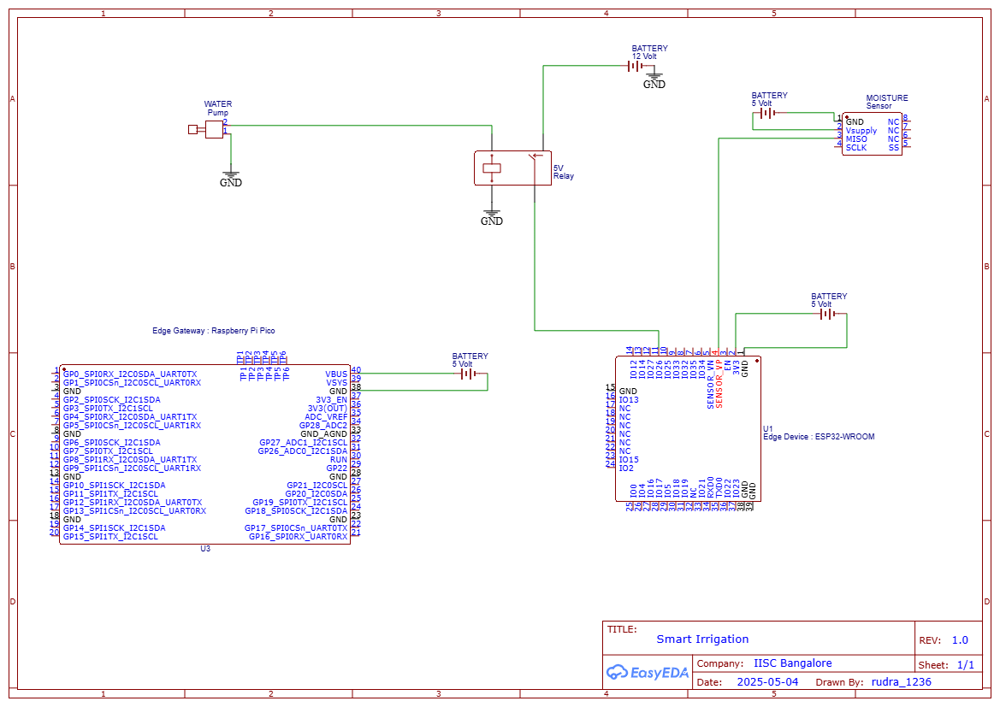
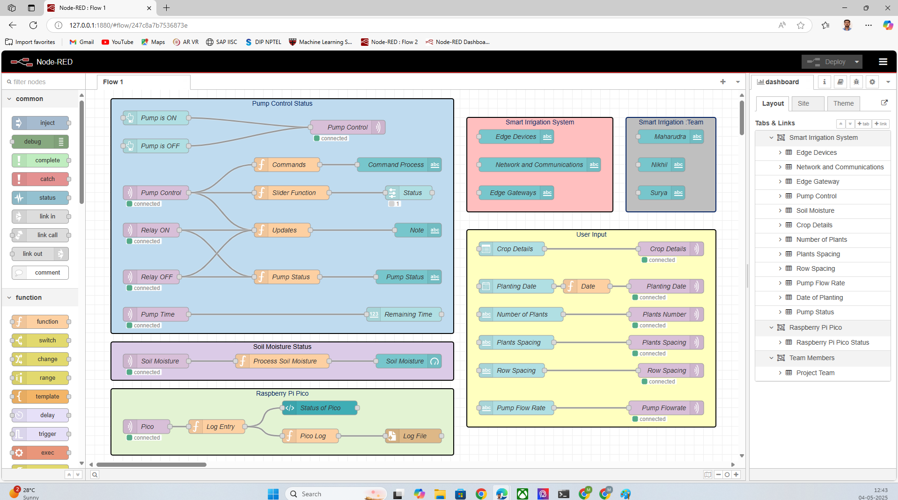
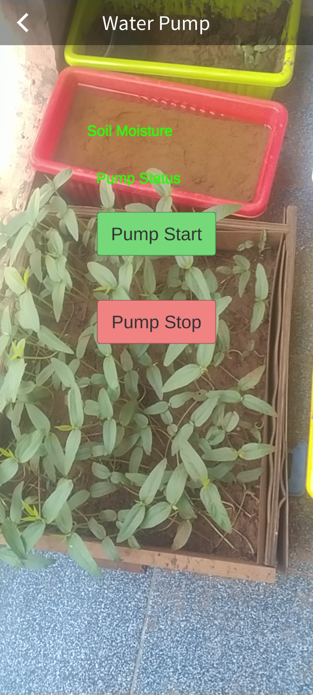
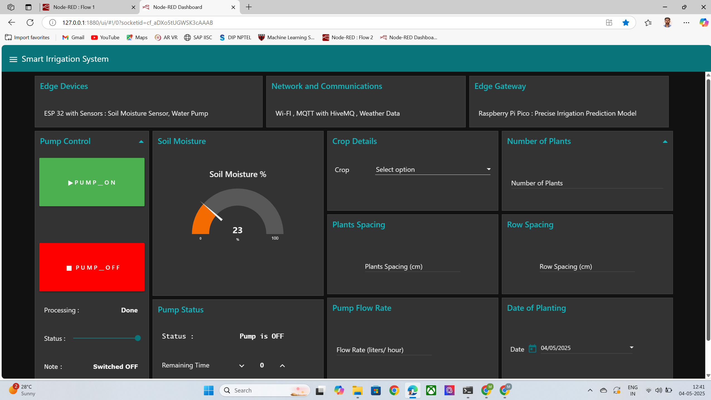
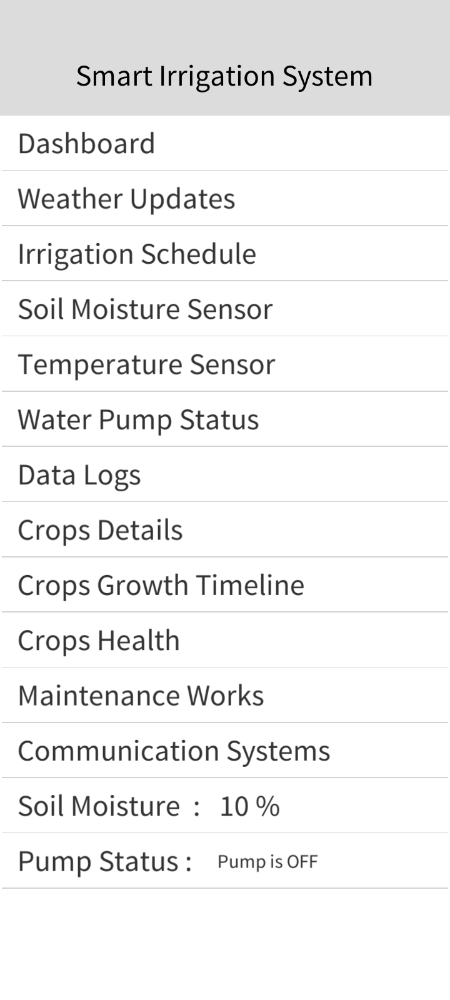
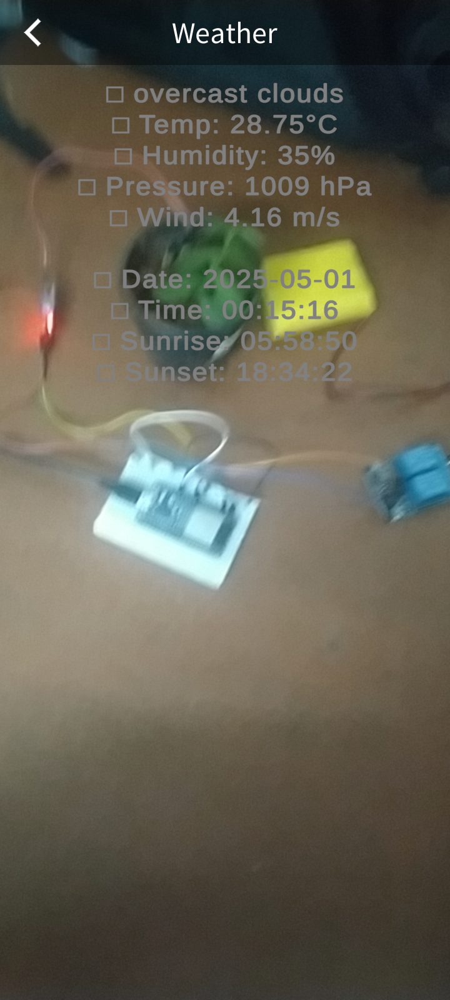
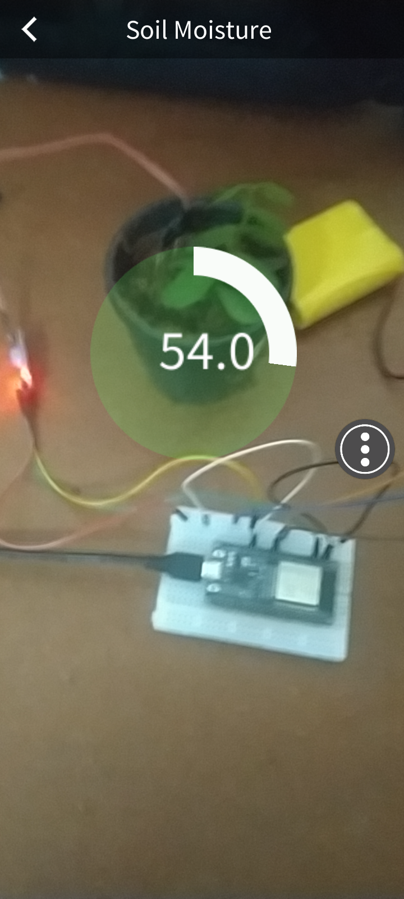

# Edge AI-Based Smart Irrigation System

## Overview

This project implements an intelligent irrigation system leveraging edge AI to optimize water usage for small farms, home gardens, seedling trays. It utilizes a Raspberry Pi Pico W to host a machine learning model that analyzes soil moisture data from analog sensors and determines the precise irrigation needs. An ESP32 acts as a communication and control unit, receiving commands from the Pico via MQTT to activate a water pump through a relay module.

## Components and Specifications

| Component             | Role/Use                                                                    | Specifications                                                                 |
|----------------------|-----------------------------------------------------------------------------|------------------------------------------------------------------------------|
| Raspberry Pi Pico W  | Hosts the MLP model and decision logic; reads sensors; computes irrigation volume. | RP2040 dual-core 133MHz MCU, 264 KB RAM, Integrated Wi-Fi module             |
| ESP32                | Receives MQTT commands from Pico; drives the pump relay for irrigation.      | Dual-core 240MHz MCU with Wi-Fi/Bluetooth                                    |
| Soil Moisture Sensor (Analog) | Measures volumetric water content (VWC); provides real-time soil moisture input. | Analog output providing VWC readings                                         |
| Relay Module         | Switches power to the water pump under ESP32 control.                      | 5V or 12V signal-controlled relay board                                     |
| Water Pump           | Physically delivers water to the crop.                                      | 12V DC submersible or inline pump (flow rate ~ [Your Pump's Flow Rate] L/min) |

## System Architecture

## Hardware Setup

This section provides details on how to set up the hardware components of the smart irrigation system.

**Wiring and Connections:**

1.  **Edge Device (ESP32):**
    * The ESP32 edge device is powered by a power bank. Ensure the power bank is adequately charged.
    * **Soil Moisture Sensor Connection:** Connect the analog output pin of the soil moisture sensor to one of the analog input pins (ADC) of the ESP32. Refer to the datasheet of your specific soil moisture sensor and ESP32 for the correct pin assignments. You will likely also need to connect the sensor's VCC and GND to the ESP32's power and ground pins.
    * **Relay Module Connection:** Connect the control input pin(s) of the 2-channel relay module to digital output pins of the ESP32. The number of control pins you use will depend on whether you are controlling one or both channels of the relay. Also, connect the relay module's VCC and GND to the ESP32's power and ground (or a separate 5V supply if required by the relay module).
    * **MQTT Communication:** The ESP32 connects to your Wi-Fi network and communicates with the HiveMQ MQTT broker over this connection.

2.  **Edge Gateway (Raspberry Pi Pico W):**
    * The Raspberry Pi Pico W edge gateway is powered by a power bank. Ensure the power bank is adequately charged.
    * **Data Processing and Control:** The Pico W receives real-time soil moisture data from the ESP32 over the MQTT connection. It also fetches weather data from the [OpenWeatherMap API](https://openweathermap.org/api).
        * **API Base URL:** The base URL for the OpenWeatherMap API is `https://api.openweathermap.org/data/2.5/`. You will need to append specific endpoints to this URL to retrieve the desired weather data (e.g., current weather, forecasts).
        * **API Key:** To use the OpenWeatherMap API, you need an API key. You can obtain a free API key by signing up on the [OpenWeatherMap website](https://openweathermap.org/). This key must be included in your API requests.
        * **Data Format:** The OpenWeatherMap API primarily returns data in JSON format, which is easily parsed by most programming languages.
    * The Pico W then processes this data using the Edge AI-based smart irrigation prediction model to calculate the ET0 (Reference Evapotranspiration) and ETc (Crop Evapotranspiration) for the specific crop (e.g., based on the provided $K_c$ value). Based on these calculations and the current soil moisture level, the Pico W determines the necessary irrigation and sends pump ON/OFF commands to the ESP32 over the MQTT connection.
    * **MQTT Communication:** The Raspberry Pi Pico W connects to your Wi-Fi network and communicates with the HiveMQ MQTT broker over this connection to receive sensor data and send control commands.

3.  **Water Pump and Power:**
    * The 12V water pump is connected to the normally open (NO) or normally closed (NC) terminals of one of the channels on the 2-channel relay module.
    * A separate 12V battery is used to power the water pump. Connect the positive and negative terminals of the 12V battery to the common (COM) and the appropriate switching terminal (NO or NC) of the relay channel that controls the pump.

**Network and Communication:**

* Both the ESP32 and the Raspberry Pi Pico W connect to your local Wi-Fi network.
* They use the HiveMQ MQTT broker for communication. The Pico W will likely publish sensor data and potentially send commands, while the ESP32 will subscribe to commands to control the relay and thus the water pump.

## Usage

This section describes how to set up and use the Edge AI-Based Smart Irrigation System.

### Initial Setup (Lab Environment)

1.  **Seedling Tray Preparation:** Place your seeds in the seedling trays with the desired soil or growth medium.
2.  **Sensor Placement:** Insert the soil moisture sensors into the seedling trays, ensuring good contact with the soil for accurate readings.
3.  **Hardware Connections:** Connect the soil moisture sensors to the ESP 32 as per your wiring diagram. Connect the relay module to the ESP32, and the water pump to the relay module, ensuring proper power supply for all components.
4.  **Software Deployment:** Flash the MicroPython firmware onto the Raspberry Pi Pico W and the ESP32 firmware onto the ESP32. Ensure the necessary libraries (e.g., `umqtt.simple`) are included.
5.  **Network Configuration:** Configure the Wi-Fi settings on both the Raspberry Pi Pico W and the ESP32 to connect to your local network.
6.  **MQTT Broker Setup):** Connect to external HiveMQ MQTT broker, ensure it is running and the Pico W and ESP32 are configured to connect to it.
7.  **Initial Monitoring:** Once the system is powered on, monitor the moisture levels reported by the sensors through the ESP 32

### Pump Control Interfaces

The water pump can be controlled through three different interfaces:

1.  **Manual On/Off via Node-RED Dashboard:**
    * Access the Node-RED dashboard that you have configured for this project.
    * On the dashboard, you will find controls (e.g., buttons or switches) to manually turn the water pump ON and OFF.
    * Use these controls as needed for manual irrigation.
  

2.  **Manual On/Off by AR App:**
    * Launch the Augmented Reality (AR) application on your mobile device.
    * Navigate to the pump control interface within the AR app.
    * The app will provide buttons or interactive elements that allow you to manually turn the water pump ON and OFF by interacting with the augmented view of your system.
  
      

3.  **Automatic Control by Edge AI Model:**
    * The system will automatically control the water pump based on the predictions of the Edge AI-based irrigation model running on the Raspberry Pi Pico W.
    * The model takes into account real-time soil moisture levels from the sensors and relevant weather data.
    * Based on the predicted crop water needs (ETc) and the current soil moisture, the Pico W will send MQTT commands to the ESP32 to turn the pump ON or OFF for a calculated duration to maintain optimal soil moisture levels.
    * The system operates autonomously once the initial setup is complete and the automatic mode is active.
  
   

Ensure all components are powered correctly and the software is running as expected for each control interface to function properly. Monitor the system's behavior during initial testing to verify the correct operation of the sensors, pump control, and the AI-driven automation.

## Code Structure

[A brief overview of the code organization]

| Tool/Language        | Platform    | Role/Use                                                                                                  | Key Libraries/Frameworks             |
|----------------------|-------------|-----------------------------------------------------------------------------------------------------------|--------------------------------------|
| Python               | PC          | Data handling, model development, training, export/deployment.                                            | pandas, numpy, scikit-learn, Jupyter |
| MicroPython          | Pico W      | Edge inference, control logic, sensor interaction, communication.                                        | Pico W (built-in), Thonny, umqtt.simple |
| ESP32 Firmware       | ESP32       | MQTT-driven pump control based on commands from Pico.                                                     | umqtt.simple                         |
| Thonny               | PC          | Flashing MicroPython firmware onto Pico W.                                                                | (IDE functionality)                  |
| umqtt.simple         | Pico W / ESP32 | Lightweight MQTT client for communication.                                                              | (MicroPython library)                |
| Jupyter Notebooks/Script | PC          | Development/execution of Python code for data processing, model training, deployment.                   | Jupyter, Python scripts              |

## Augmented Reality Based Smart Irrigation

This project incorporates an augmented reality (AR) application to enhance user interaction and understanding. The AR app allows users to visualize sensor data overlaid on the physical system, get real-time moisture readings, control the water pump, and access system status and alerts.

You can access the files and resources for the AR application in the following Google Drive folder:

[AR App Resources](https://drive.google.com/drive/folders/1TpJTIjEVfzm5t6Ri8KKJVAxK5ShAxkX6?usp=drive_link)

The folder contains:

* AR app APK (for Android)
* Unity AR App Source
* Documentation

Further development of the AR application could include interactive controls and user customization of visualizations.

## Conclusion

This project demonstrates a complete Edge AI solution for precision irrigation in nursery crops. By leveraging long-term climate data and an on-device MLP model, the system accurately predicts crop water needs (ETc) in real-time. The integration of crop coefficients (e.g., onion $K_c$) and soil moisture feedback ensures that watering is neither excessive nor insufficient at any stage. In trials, the Pico W's MLP inference achieved approximately 97% accuracy ($R^2 \approx 0.97$) against FAO-56 benchmarks, validating the approach. The edge deployment (MLP code in MicroPython) is lightweight and runs without cloud dependency. Hardware such as the ESP32 pump controller and moisture sensors have been successfully combined with the AI model into a functional prototype.

Moving forward, the system can be extended with a user interface (LCD or app) for monitoring, additional sensors (e.g., temperature probes), or ensemble models for other crops. The modular software and complete documentation on GitHub make it straightforward for technical teams to replicate or customize the system. Overall, this work provides a blueprint for water-efficient, smart irrigation solutions that marry domain knowledge (FAO ET₀, $K_c$) with modern edge AI techniques.

Furthermore, an accompanying **Augmented Reality (AR) application** provides an intuitive user interface for visualizing sensor data, manually controlling the pump, and accessing system status, enhancing the overall user experience. Future work could focus on expanding the capabilities of this AR app for more interactive control and data insights.

## Contributing

We welcome contributions to the Edge AI-Based Smart Irrigation System project! If you're interested in helping out, please follow these guidelines:

### How to Contribute

1.  **Fork the Repository:** Start by forking the repository to your own GitHub account. This creates a copy of the project that you can freely modify.

2.  **Create a Branch:** Before making any changes, create a new branch from the `main` branch. Choose a descriptive name for your branch that indicates the feature or fix you're working on (e.g., `feature/new-sensor-integration`, `bugfix/mqtt-connection-issue`).

### Contribution Guidelines

* **Code Style:** Please try to adhere to the existing code style used in the project. For MicroPython and Python, follow PEP 8 conventions where applicable.
* **Documentation:** Keep documentation up-to-date with your changes. If you add new features or modify existing ones, update the relevant comments, docstrings, and the `README.md` file if necessary.
* **Testing:** Contributions that include tests are highly encouraged. Well-tested code is more likely to be merged.
* **Communication:** If you have questions or want to discuss potential contributions, please feel free to open an issue in the repository.
* **Respectful Communication:** Please be respectful and considerate of other contributors in all discussions and interactions.

### Types of Contributions We Welcome

* **Bug Fixes:** Identifying and fixing bugs in the existing code.
* **New Features:** Implementing new functionalities, such as support for additional sensors, integration with other platforms, or improvements to the AI model.
* **Documentation Improvements:** Enhancing the clarity, accuracy, and completeness of the project's documentation.
* **Code Refactoring:** Improving the structure, readability, and efficiency of the code.
* **Testing:** Writing unit, integration, or end-to-end tests.
* **Examples and Tutorials:** Creating examples or tutorials that demonstrate how to use the system or its components.
* **AR App Enhancements:** Contributing to the development and features of the Augmented Reality application.

We appreciate your interest in contributing to this project and look forward to your valuable contributions!
## License

This project is licensed under the MIT License - see the [LICENSE](LICENSE) file for details.
